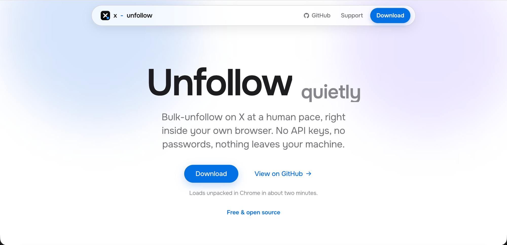

<p align="center">
  <a href="https://oxisrafil.github.io/x-unfollow">
    
  </a>
</p>

# x-unfollow

<p align="center">
  <a href="https://x.com/israfill"></a>
  <a href="https://github.com/OxIsrafil/x-unfollow/stargazers"></a>
  <a href="LICENSE"></a>
</p>

Bulk-unfollow accounts on X (x.com) from your own following list, at a human pace. Use it as a browser extension (easiest) or a small CLI tool. Either way you can watch it work and stop it at any time.

No API keys. No passwords stored. Nothing leaves your machine.

## Browser extension (no terminal needed)

Prefer clicking over terminals? The same engine ships as a Chrome extension in [`extension/`](extension/).

1. Download this repo as a ZIP ([direct link](https://github.com/OxIsrafil/x-unfollow/archive/refs/heads/main.zip)) and unzip it
2. Open `chrome://extensions` in Chrome
3. Turn on **Developer mode** (top right)
4. Click **Load unpacked** and select the `extension` folder from the unzipped download
5. If x.com was already open, reload that tab once so the extension attaches
6. Log in to X, open `x.com/yourhandle/following`, click the x-unfollow icon, press **Start**

Same rules as the CLI: 20-50 second pacing, hard cap of 600 per day, and a protected-handles list. To protect someone, just click the **Protect** button that appears on each account on your following page (or type handles in the popup) - protected accounts are never unfollowed. Keep the tab open while it runs; closing the popup is fine. Chrome slows timers in background tabs, so pacing gets slower (never faster) if you switch away.

## How it stays safe

- Randomized 20-50 second delay between unfollows, plus a 4-10 minute break every 10 unfollows
- Hard cap of 600 unfollows per day (local time), remembered across runs in `unfollow_daily_state.json`
- A protected-handles list the tool will never unfollow
- Nothing runs until you start it (type `UNFOLLOW START` in the CLI, or press Start in the extension popup)
- Unknown popups are dismissed, never confirmed; unfollow confirmations are only clicked in one explicit, dedicated step
- You stay in control: watch it work and stop any time (Ctrl+C in the CLI, the Stop button in the extension popup)

## Setup

Requires Node.js 22.14 or newer.

```bash
git clone https://github.com/OxIsrafil/x-unfollow.git
cd x-unfollow
npm install
npx playwright install chromium
```

## Usage

```bash
npm start
```

1. Type `UNFOLLOW START` to confirm
2. Enter your X handle (without @)
3. Choose how many to unfollow this session (default 35)

On the first run a browser opens at the X login page. Log in, then press Enter in the terminal. Your session is saved to `auth.json` so you only log in once.

## Protecting accounts

Copy the example file and add handles you never want to unfollow:

```bash
cp unfollow_protect_handles.example.txt unfollow_protect_handles.txt
```

One handle per line, with or without @.

## Important

- **Never share `auth.json`.** It contains your X session cookies and grants access to your account. It is gitignored by default.
- Automating actions on X may violate the [X Terms of Service](https://x.com/en/tos) and can lead to rate limits or account restrictions. This tool is intentionally slow and conservative, but no guarantees are made. Use at your own risk.
- This tool only unfollows from your own following list. It cannot post, reply, like, or follow.

## Privacy

x-unfollow collects nothing and has no server - everything runs in your own browser or terminal. Full details in [PRIVACY.md](PRIVACY.md).

## Author

Built by [@israfill](https://x.com/israfill). If x-unfollow saved you an afternoon, a follow on X means a lot and helps more people find it.

## License

[MIT](LICENSE)
